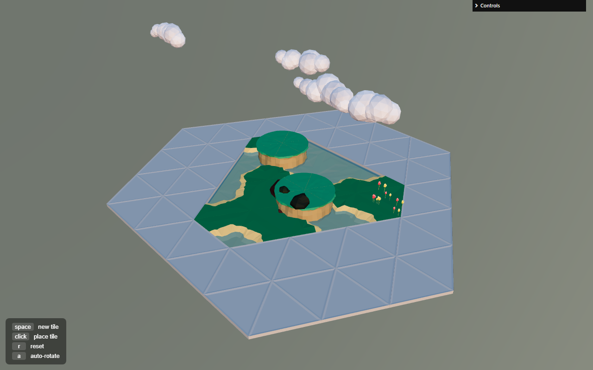

# Animal Crossing Scene Generator

**[Live Demo →](https://kiara-vong.github.io/animal-crossing/)**

A procedural 3D scene generator that builds an *Animal Crossing*-inspired island, tile by tile, using the **Wave Function Collapse** algorithm — the same class of technique used in games like *Bad North* and *Caves of Qud* to generate coherent worlds from a small set of hand-modeled pieces.



## Why this project

This started as an exploration of procedural generation and constraint-solving algorithms, and turned into a full pipeline: modeling tiles in Blender, exporting them as glTF, and writing a constraint solver from scratch in JavaScript to assemble them into a scene that always looks intentional rather than random.

## How it works

- The island is a grid of **triangular tiles** rather than squares — this cuts down the number of unique pieces needed to tile a surface seamlessly, at the cost of a trickier coordinate system (each tile has 3 possible rotations, not 4).
- Each tile type declares which of its three edges can legally border which edges on neighboring tiles (**adjacency constraints**) — a coastline edge, for example, can only border another coastline edge or open water, never a cliff face.
- The generator repeatedly picks the **cell with the fewest remaining valid options** first ("lowest entropy" — collapsing the most-constrained cells early avoids painting the algorithm into a contradiction later), locks in one of its options at random, then propagates that constraint outward to its neighbors, narrowing their options in turn.
- Clicking any tile forces a specific type at that position and re-propagates from there — generation isn't purely automatic, it's steerable.

## Controls

| Key / Action | Effect |
|---|---|
| `space` | Generate the next tile |
| `click` | Place a specific tile at that position |
| `r` | Reset the board |
| `a` | Toggle camera auto-rotate |

## Tech stack

- **React** + **react-three-fiber** (a React renderer for Three.js — lets the scene graph be declarative JSX instead of imperative Three.js calls)
- **@react-three/drei** for camera controls, environment lighting, and glTF loading/preloading
- **Three.js** for the underlying WebGL rendering
- **Blender**, for modeling and exporting the tile set as `.glb`
- Custom **GLSL** vertex shaders for procedural coloring on rocks and foliage
- Create React App (via `react-app-rewired`, for shader-file webpack config)

## Run it locally

```bash
npm install
npm start        # dev server at localhost:3000
npm run build    # production build
npm run deploy   # publish build/ to the gh-pages branch
```
